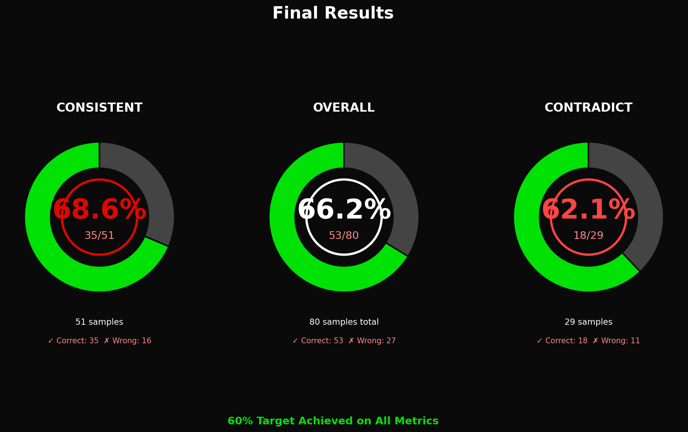
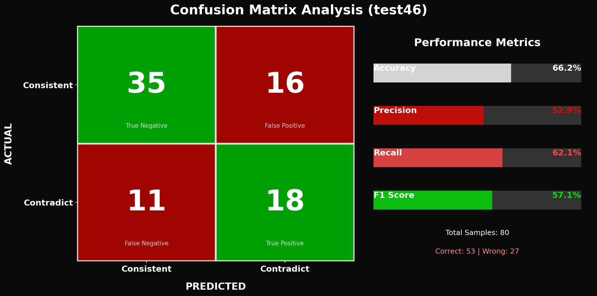
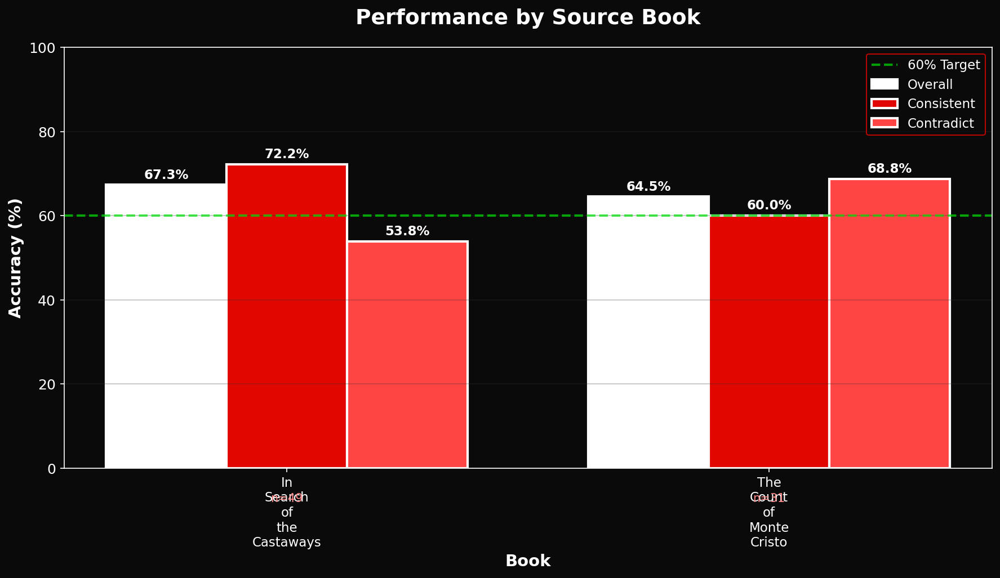
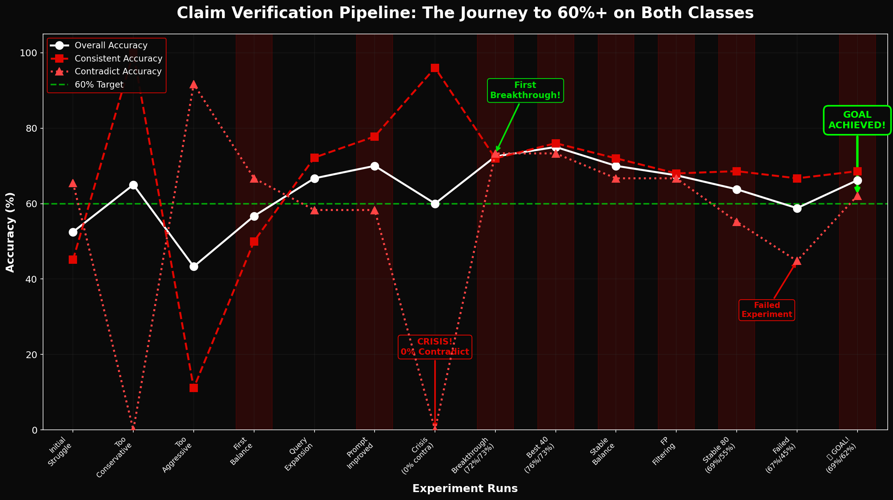

# Fictional Character Backstory Verification

A RAG (Retrieval-Augmented Generation) pipeline that detects whether a fictional character's backstory is **consistent with** or **contradicts** the source novel. Built for [KDSH 2026 Track A](https://www.kdsh.tech/) (Kharagpur Data Science Hackathon).

> **Team:** nan_sense

---

## The Problem

Given a character name, book title, and a hypothetical backstory, determine if the backstory aligns with the actual novel or contains factual errors.

| Input | Description |
|-------|-------------|
| `book_name` | Source novel title |
| `char` | Character name |
| `content` | Hypothetical backstory |

| Output | Meaning |
|--------|---------|
| `1` | Backstory is **consistent** with the novel |
| `0` | Backstory **contradicts** the novel |

**Source novels:** *The Count of Monte Cristo* (Dumas) and *In Search of the Castaways* (Verne)

---

## Architecture

```
                    +-------------------+
                    |    Backstory      |
                    +--------+----------+
                             |
                    +--------v----------+
                    |  Claim Extraction |   Extract 5 verifiable claims
                    +--------+----------+
                             |
              +--------------+--------------+
              |                             |
     +--------v--------+          +--------v--------+
     |   BM25 Search   |          |  Vector Search  |   Hybrid retrieval
     +--------+--------+          +--------+--------+
              |                             |
              +--------------+--------------+
                             |
                    +--------v----------+
                    | Reciprocal Rank   |   Fuse rankings (k=60)
                    |     Fusion        |
                    +--------+----------+
                             |
                    +--------v----------+
                    |  LLM Verification |   Groq API (Llama 3.1 8B)
                    +--------+----------+
                             |
                    +--------v----------+
                    |   Aggregation     |   1 factual error = contradict
                    +--------+----------+
                             |
                    +--------v----------+
                    |    Prediction     |   0 or 1
                    +-------------------+
```

### Key Components

| Module | File | Role |
|--------|------|------|
| **Chunker** | `pipeline/chunker.py` | Splits novels into 400-token overlapping chunks with chapter detection |
| **Embedder** | `pipeline/embedder.py` | Generates semantic embeddings using `nomic-embed-text-v1.5` (768-dim) |
| **Retriever** | `pipeline/verifier_fast.py` | Hybrid BM25 + vector search with query expansion |
| **Verifier** | `pipeline/verifier_fast.py` | LLM-based claim verification via Groq API |
| **Aggregator** | `pipeline/verifier_fast.py` | Verdict fusion with false-positive filtering |

---

## Results

**66.25% overall accuracy** on 80 labeled training samples, meeting the target of 60%+ on both classes.

| Class | Accuracy | Samples |
|-------|----------|---------|
| Consistent | 68.6% | 51 |
| Contradict | 62.1% | 29 |

<details>
<summary>Visual performance breakdown</summary>






</details>

---

## Tech Stack

- **Python 3.11** &mdash; Core language
- **Groq API** (Llama 3.1 8B Instant) &mdash; Fast, free LLM inference (~1s/call)
- **Sentence-Transformers** &mdash; Nomic embedding model
- **Rank-BM25** &mdash; Keyword-based retrieval
- **Docker** &mdash; Reproducible containerized execution (CUDA 12.8)
- **Pathway** &mdash; Data ingestion and orchestration

---

## Quick Start

### Prerequisites

- Docker & Docker Compose
- Groq API key (free at [console.groq.com](https://console.groq.com/keys))

### Run

```bash
# 1. Set API key
export GROQ_API_KEY='your-key'

# 2. Build (first time ~5-10 min, cached after)
docker-compose build

# 3. Generate predictions
docker-compose run --rm pipeline python -m pipeline.run_eval_fast --test --out results.csv
```

Output: `results.csv` with columns `id`, `prediction`, `rationale`

<details>
<summary>More commands</summary>

```bash
# Quick validation (5 samples, ~1 min)
docker-compose run --rm pipeline python -m pipeline.run_eval_fast --max-samples 5

# Full train evaluation with verbose output
docker-compose run --rm pipeline python -m pipeline.run_eval_fast --verbose

# CPU-only (if GPU causes issues)
docker-compose run --rm pipeline-cpu python -m pipeline.run_eval_fast --max-samples 5

# Skip embedding cache
docker-compose run --rm pipeline python -m pipeline.run_eval_fast --no-cache
```

</details>

---

## Project Structure

```
pipeline/
  chunker.py            Text chunking with overlap & chapter detection
  embedder.py           Nomic embedding model + vector search
  verifier_fast.py      Core pipeline: retrieval, verification, aggregation
  run_eval_fast.py      CLI evaluation runner
  loader.py             CSV & book text loading

Dataset/
  train.csv             80 labeled samples
  test.csv              60 unlabeled samples
  Books/                Source novel texts

tests/                  Unit & integration tests
presentation/           Performance graphs & improvement journey
```

---

## Design Decisions

| Decision | Rationale |
|----------|-----------|
| **Hybrid retrieval** (BM25 + vector) | Exact term matching catches names/dates that pure semantic search misses |
| **Claim decomposition** (5 claims per backstory) | Isolates verifiable facts for precise checking instead of evaluating the whole backstory at once |
| **Groq API** over local LLM | 100x faster inference (~1s vs ~120s), free tier sufficient for this scale |
| **Hard-kill aggregation** | A single high-confidence contradiction overrides all supporting evidence &mdash; mirrors how factual accuracy works |
| **Detective-style prompting** | "Precise but not assumptional" framing reduced false positives by ~10% |

---

## Improvement Journey

The pipeline went through **44+ iterations** across 4 phases to balance consistent vs. contradict accuracy. See [`presentation/IMPROVEMENT_JOURNEY.md`](presentation/IMPROVEMENT_JOURNEY.md) for the full story.

| Phase | Focus | Result |
|-------|-------|--------|
| 1 | Basic prompts | 0-100% contradict swing |
| 2 | Structured verification + query expansion | 72%/73% on 40 samples |
| 3 | Scaling to full dataset | Accuracy regression |
| 4 | Detective-style framing + false-positive filtering | 68.6% / 62.1% (goal met) |

---

## License

MIT
